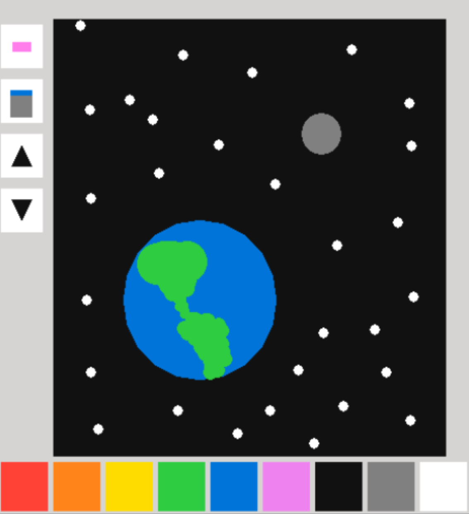

# Simple-MS-Paint-Clone

 A recreation of the classic program created entirely using Ruby2d 

## Table of Contents
- [About](#about)
- [Getting Started](#getting_started)
- [How to Use](#usage)
- [Authors](#authors)
## About 
This program was created in order to display and improve my skills in Ruby and using the Ruby2d Gem. This program was written in one day.
## Getting Started 
What you will need to run this program: 
- <em>Ruby</em>- To run this program, you must have some way to run a .rb file. Also, this program was written using Ruby 2.7.1, and has not been tested using any other version. You must also install the <em>ruby2d</em> gem to properly use the program.
## How to Use 
After installing and adding everything necessary, you should be fully able to use the program. The program has 9 different colors to choose from, an erase button, a button to change the backround color, and buttons to increase and decrease the size of your brush.
## Author 
[@AlexHettle](https://github.com/AlexHettle) - Sole author of project
